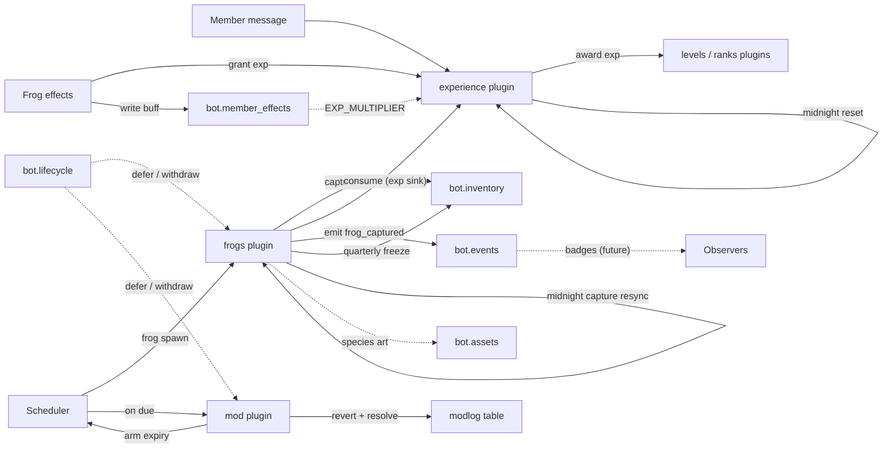

# CazzuBot — Systems Map

Current systems of the bot and how they interact. Keep this chart in sync
when a system, service, or plugin edge changes.

## Reading it

- **The grind core (left):** messages → `experience` awards exp →
  `levels`/`ranks` presenters; `experience` owns the midnight reset
  (msg counts, cooldowns, lifetime resync). The deterministic
  progression axis.
- **The frogs loop (top):** `Scheduler` spawns frogs → capture →
  `bot.inventory` (+1) → consume feeds back into exp (the sink);
  `frogs` owns the `quarterly` freeze (season rollover) and the
  `daily.frog` capture resync (the other half of the midnight reset);
  frog **effects** grant exp or write buffs into `bot.member_effects`,
  which `award_exp` reads (the multiplier seam); species art resolves
  through `bot.assets`.
- **The observation spine:** capture/consume emit `frog_captured` /
  `frog_consumed` on `bot.events` — the future badges/achievements hook
  (dashed edge).
- **Moderation (right):** `mod` arms expiry tasks on the `Scheduler`; on
  due it reverts the action and marks the `modlog` row resolved
  (state-backed scheduling — the task is a projection of the modlog).
  **`mod` ships disabled** (`enabled = False`) — it doesn't load at boot
  until the owner enables it (`plugin enable mod`); the chart shows its
  wiring for when it's up.
- **Under everything:** `bot.lifecycle` defers/withdraws each plugin's
  runtime effects on load/unload (dashed edges to the plugins that
  declare undos); the whole thing sits on SQLite (`bot.db`) plus
  `bot.settings`.

Solid arrows = active data flow; dashed = observation / lifecycle seams.

## Legend of the boxes

- `bot.*` boxes are core services on `CazzuBot`.
- Named `plugin` boxes are feature plugins under `plugins/`.
- `"Scheduler"` / `"Member message"` are runtime entry points (tasks
  table, gateway events).
